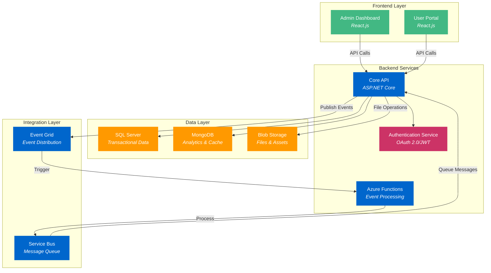

# Comprehensive Azure Cloud Service Deployment Guide

## Document Information

- **Document ID**: AZURE-DEPLOY-GUIDE-001
- **Version**: 1.0
- **Last Updated**: March 31, 2025
- **Authors**: Leeroy D'Souza


## Scope and Purpose

This document provides a comprehensive guide for deploying a scalable SaaS Task Management Platform using Azure Cloud Services. It covers the complete deployment process, from infrastructure setup to application configuration, and includes best practices for maintaining and scaling the solution.

**Scope**:

- Azure Cloud Service deployment configuration
- Infrastructure setup and management
- Application deployment procedures
- Monitoring and maintenance guidelines

**Non-Scope**:

- Application development details
- Database schema design
- Frontend implementation specifics
- Security compliance requirements

## Target Audience

This document is intended for:

- Cloud Engineers responsible for infrastructure deployment
- DevOps Engineers managing application deployment
- System Administrators maintaining cloud resources
- Technical Leads overseeing cloud infrastructure

**Prerequisites**:

- Basic understanding of Azure Cloud Services
- Familiarity with PowerShell scripting
- Knowledge of cloud infrastructure concepts
- Understanding of deployment automation principles

## Table of Contents

1. Introduction
2. Project Overview
3. Technical Architecture
4. Key Features
5. Technical Challenges
6. Development Approach
7. Project Deliverables
8. Step-by-Step Implementation Guide
9. Monitoring and Maintenance
10. Troubleshooting Guide
11. Best Practices
12. Conclusion

## Project Overview

The Task Management Platform is a multi-tenant SaaS application designed to handle large volumes of data efficiently. The system provides:

- Project and task management capabilities
- Advanced analytics and reporting
- Workflow automation features
- Real-time collaboration tools
- Scalable architecture for growth

## Technical Architecture

The platform utilizes a multi-layer architecture combining traditional cloud services with modern Azure features:



### Key Architectural Components

1. **Event Processing Flow**:
          - Event Grid acts as the central event distribution hub
  - Azure Functions handle event processing asynchronously
  - Service Bus provides guaranteed delivery for critical operations


2. **Data Strategy**:
          - SQL Server manages transactional data and task relationships
  - MongoDB handles analytics data and caching for better performance
  - Blob Storage stores files and attachments securely


3. **Security Implementation**:
          - OAuth 2.0/JWT authentication ensures secure access
  - Token validation occurs at the API gateway level
  - All API calls pass through the Authentication Service


## Key Features

1. **Multi-Tenancy Support**```csharp
public class TenantContext
{
    public Guid TenantId { get; private set; }
    public string DatabaseName { get; private set; }
    public string StorageAccount { get; private set; }

    private TenantContext(Guid tenantId, string databaseName, string storageAccount)
    {
        TenantId = tenantId;
        DatabaseName = databaseName;
        StorageAccount = storageAccount;
    }

    public static TenantContext CreateTenant(Guid tenantId, string databaseName, string storageAccount)
    {
        return new TenantContext(tenantId, databaseName, storageAccount);
    }
}
```


2. **Event Grid Integration**```csharp
public class TaskCreatedEventHandler
{
    [FunctionName("TaskCreatedHandler")]
    public async Task Run([EventGridTrigger]EventGridEvent eventGridEvent, ILogger logger)
    {
        logger.LogInformation($"Received event: {eventGridEvent.EventType}");
        
        if (eventGridEvent.EventType == "Microsoft.Storage.BlobCreated")
        {
            await ProcessBlobCreated(eventGridEvent);
        }
    }
}
```


## Technical Challenges and Solutions

1. **Performance Optimization**  - Implement caching strategies
  - Use connection pooling
  - Optimize database queries
  - Implement CDN for static resources


2. **Scalability Solutions**  - Horizontal scaling of web roles
  - Database sharding strategy
  - Load balancing configuration
  - Auto-scaling rules implementation


## Step-by-Step Implementation Guide

### Prerequisites

```powershell
# Install Azure PowerShell module
Install-Module -Name Az -AllowClobber -Scope CurrentUser

# Connect to Azure
Connect-AzAccount

# Set subscription context
Set-AzContext -SubscriptionId <your-subscription-id>
```

### Infrastructure Setup

```powershell
# Create resource group
$resourceGroupName = "task-management-platform"
$location = "eastus"
New-AzResourceGroup -Name $resourceGroupName -Location $location

# Create storage account
$storageAccountName = "taskmanagementstorage"
New-AzStorageAccount -ResourceGroupName $resourceGroupName `
                     -Name $storageAccountName `
                     -Location $location `
                     -SkuName Standard_LRS
```

### Cloud Service Deployment

```powershell
# Create cloud service
$cloudServiceName = "task-management-cloud-service"
New-AzCloudService -ResourceGroupName $resourceGroupName `
                   -Name $cloudServiceName `
                   -Location $location

# Deploy cloud service
$deploymentName = "Production"
$packagePath = "C:\Deployment\TaskManagement.cspkg"
$configPath = "C:\Deployment\ServiceConfiguration.Cloud.cscfg"

$deploymentConfig = New-AzCloudServiceDeploymentConfig `
                    -PackageUrl $packagePath `
                    -Configuration $configPath `
                    -Mode Auto

New-AzCloudServiceDeployment -ResourceGroupName $resourceGroupName `
                             -CloudServiceName $cloudServiceName `
                             -Configuration $deploymentConfig `
                             -DeploymentName $deploymentName
```

## Monitoring and Maintenance

1. **Diagnostics Configuration**```powershell
$diagConfig = New-AzCloudServiceDiagnosticsExtension `
              -ResourceGroupName $resourceGroupName `
              -CloudServiceName $cloudServiceName `
              -StorageAccountName $storageAccountName `
              -StorageAccountKey (Get-AzStorageAccountKey -ResourceGroupName $resourceGroupName -Name $storageAccountName).Value[0]

Set-AzCloudServiceExtension -ResourceGroupName $resourceGroupName `
                           -CloudServiceName $cloudServiceName `
                           -ExtensionName "Microsoft.Azure.Diagnostics" `
                           -ExtensionType "PaaSDiagnostics" `
                           -ExtensionPublisher "Microsoft.Azure.Diagnostics" `
                           -Setting $diagConfig
```


2. **Auto-Scaling Setup**```powershell
$autoScaleProfile = New-AzAutoscaleProfile `
                    -Name "AutoScaleProfile" `
                    -DefaultCapacity 2 `
                    -MaximumCapacity 10 `
                    -MinimumCapacity 2

$rule = New-AzAutoscaleRule `
        -MetricName "Percentage CPU" `
        -MetricResourceId "/subscriptions/<subscription-id>/resourceGroups/$resourceGroupName/providers/Microsoft.Compute/cloudServices/$cloudServiceName" `
        -TimeGrain 00:01:00 `
        -MetricStatistic "Average" `
        -TimeWindow 00:10:00 `
        -TimeAggregation "Average" \
        -Operator "GreaterThan" \
        -Threshold 75 \
        -ScaleActionDirection "Increase" \
        -ScaleActionScaleType "ChangeCount" \
        -ScaleActionValue 1 \
        -CoolDown 00:10:00

Add-AzAutoscaleSetting -ResourceGroupName $resourceGroupName `
                       -Name "AutoScaleSetting" `
                       -Location $location `
                       -TargetResourceId "/subscriptions/<subscription-id>/resourceGroups/$resourceGroupName/providers/Microsoft.Compute/cloudServices/$cloudServiceName" `
                       -AutoscaleProfile $autoScaleProfile `
                       -AutoscaleRule $rule
```


## Troubleshooting Guide

1. **Common Issues and Solutions**:
          - Deployment failures: Check storage account accessibility and certificate configurations
  - Authentication errors: Verify OAuth 2.0 configuration and JWT token validity
  - Performance issues: Review scaling settings and resource utilization
  - Data inconsistencies: Check Event Grid subscription status and Service Bus queue processing


2. **Monitoring Checklist**:
          - Review deployment logs regularly
  - Monitor CPU and memory usage
  - Check event grid subscription health
  - Verify database connection strings
  - Monitor storage account performance


## Best Practices

1. **Security**:
          - Implement role-based access control (RBAC)
  - Use managed identities for service authentication
  - Enable encryption at rest and in transit
  - Regular security assessments and updates


2. **Performance**:
          - Implement caching strategies
  - Use connection pooling
  - Optimize database queries
  - Monitor resource utilization regularly


3. **Maintenance**:
          - Schedule regular updates
  - Implement backup strategies
  - Document changes and updates
  - Maintain deployment scripts


## Conclusion

This comprehensive guide provides a detailed roadmap for deploying and maintaining a scalable Task Management Platform on Azure Cloud Services. By following these steps and best practices, organizations can ensure reliable, secure, and efficient deployment of their SaaS application. Remember to regularly review and update the documentation as your platform evolves.

## Revision History

| Version | Date | Changes | Author |
| --- | --- | --- | --- |
| 1.0 | March 31, 2025 | Initial document creation | Leeroy D'Souza |

## Approval

 

**Note**: Replace all placeholder values (like subscription IDs and file paths) with actual information and always test deployments in a non-production environment before applying to production workloads.
